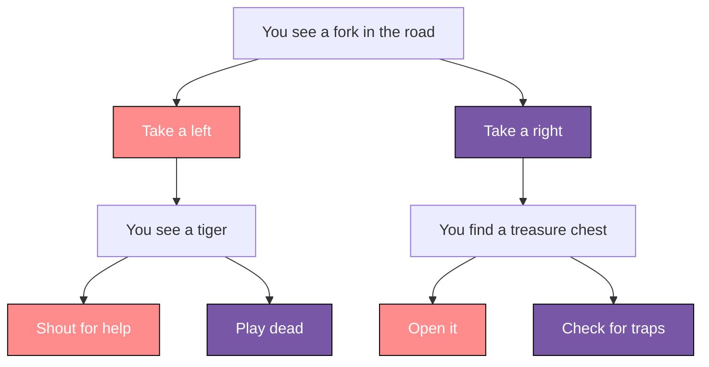

<h1 align="center" id="title">Destiny Game</h1>

<p align="center">
  
</p>

<p id="description">This is a “choose your own adventure” game similar to the App Store hit “Life Line” app.</p>

## Demo


## Features

Here're some of the project's best features:

*   Follow a predefined story
*   Make yout own decisions to proceed
*   Try the multple paths

## Installation Steps:

1. Clone the repository.
2. Open the project with Xcode.
3. Run the app and enjoy it.

## The process 
### Built with

Technologies used in the project:

*   Swift 5.6
*   Xcode 13.3
*   iOS 15.5

### Diagrams


### Story structure

``` Swift
// Story struct
struct Story {
  let title: String
  let choice1: String
  let choice1Destination: Int
  let choice2: String
  let choice2Destination: Int
}
```

``` Swift
// Story collection
let stories = [
  Story(
    title: "He nods slowly, unfazed by the question.",
    choice1: "At least he's honest. I'll climb in.", choice1Destination: 2,
    choice2: "Wait, I know how to change a tire.", choice2Destination: 3
  ),
]
```

## Useful resources

* [Canva](https://www.canva.com) - Used to create graphics.
* [Classes and Structures](https://docs.swift.org/swift-book/LanguageGuide/ClassesAndStructures.html) - A guide to Structures and Classes.

## Author

Alex Camacho - [alexcamachogz](https://twitter.com/alexcamachogz)

>This is a companion project to The App Brewery's Complete App Development Bootcamp, check out the full course at [www.appbrewery.co](https://www.appbrewery.co/)
